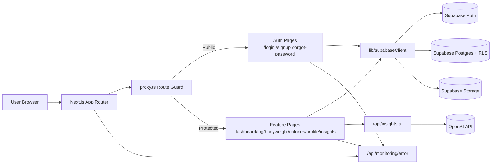

# Trainlytics

<p align="center">
  <strong>A focused fitness tracker for consistent training, clean per-user data boundaries, and reliable auth flows.</strong>
</p>

<p align="center">
  <a href="https://trainlytics-gold-mu.vercel.app">Live Demo</a>
</p>

<p align="center">
  
  
  
  
  
</p>

## Why Trainlytics

Trainlytics is built for lifters who want low-friction tracking and trustworthy data isolation.

- OTP-backed signup and password reset flows
- Workout logging by split (`push`, `pull`, `legs`, `core`)
- User-scoped exercise management with archive, unarchive, and permanent delete flows
- Guided workout export by category, muscle group, or exercise in CSV, XLSX, and PDF
- Bodyweight and calorie tracking
- Dashboard and insights trends
- Strong route guarding + Supabase RLS isolation
- Built-in monitoring endpoint for runtime/auth/API issues

## Table of Contents

- [Tech Stack](#tech-stack)
- [Quick Start](#quick-start)
- [Environment Variables](#environment-variables)
- [Architecture](#architecture)
- [Route Contract](#route-contract)
- [Quality Checks](#quality-checks)
- [Database Workflow](#database-workflow)
- [E2E Tests](#e2e-tests)
- [Monitoring](#monitoring)
- [Deployment (Vercel)](#deployment-vercel)
- [Security](#security)
- [Roadmap](#roadmap)

## Tech Stack

- Next.js 16 (App Router)
- React 19 + TypeScript
- Tailwind CSS 4
- Supabase (Auth, Postgres, Storage, RLS)
- `xlsx`, `jspdf`, `jspdf-autotable` for workout exports
- Vitest (unit tests)
- Playwright (auth-critical E2E)

## Quick Start

```bash
npm install
npm run dev
```

App URL: `http://localhost:3000`

## Environment Variables

Create `.env.local`:

```bash
# Required
NEXT_PUBLIC_SUPABASE_URL=https://YOUR_PROJECT_REF.supabase.co
NEXT_PUBLIC_SUPABASE_ANON_KEY=YOUR_SUPABASE_ANON_KEY
SUPABASE_SERVICE_ROLE_KEY=YOUR_SUPABASE_SERVICE_ROLE_KEY

# Optional (Insights AI chat only)
OPENAI_API_KEY=YOUR_OPENAI_API_KEY
OPENAI_MODEL=gpt-4o-mini
OPENAI_BASE_URL=https://api.openai.com/v1
```

- Never expose `SUPABASE_SERVICE_ROLE_KEY` in browser/client code.
- `NEXT_PUBLIC_SUPABASE_ANON_KEY` must be your anon key, not service role.

## Architecture

Core directories:

- `app/` routes and API endpoints
- `features/` feature modules (UI + domain logic)
- `lib/` shared services/utilities (auth, routes, monitoring, helpers)
- `db/` schema, migrations, audits, migration plan
- `scripts/db/` DB plan runner + validator
- `e2e/` Playwright suite

### System Diagram


```mermaid
flowchart LR
  U[User Browser] --> N[Next.js App Router]
  N --> P[proxy.ts Route Guard]
  P -->|Public| A[Auth Pages<br/>/login /signup /forgot-password]
  P -->|Protected| F[Feature Pages<br/>dashboard/log/bodyweight/calories/profile/insights]

  A --> SC[lib/supabaseClient]
  F --> SC
  SC --> SA[(Supabase Auth)]
  SC --> SD[(Supabase Postgres + RLS)]
  SC --> SS[(Supabase Storage)]

  F --> API2["/api/insights-ai"]
  API2 --> OAI[(OpenAI API)]

  N --> MON["/api/monitoring/error"]
  A --> MON
  F --> MON
```

### Runtime Flow

1. Requests hit `proxy.ts`, enforcing public/protected route access.
2. Client pages use `lib/supabaseClient` for auth/session and scoped data.
3. Supabase RLS policies enforce per-user table isolation.
4. Server routes handle optional AI insights and operational monitoring.
5. Client/server runtime errors are reported via `/api/monitoring/error`.

### Key Product Behaviors

- Active exercises are managed directly from the logger for faster workout setup.
- Archived exercises are managed from Profile, where users can unarchive or permanently delete them.
- Permanent delete removes the exercise row and related workout history from Supabase for that user.
- Export is contextual to the logger and supports category-level, muscle-group-level, and exercise-level history downloads.