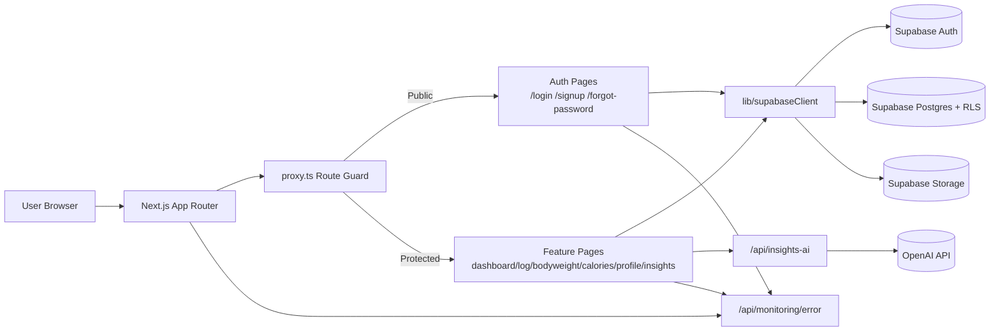

# Trainlytics

A multi-tenant fitness analytics platform where every user's training data is isolated
at the database layer — workout logging, bodyweight and calorie tracking, dashboard
trends, and an AI insights chat, for lifters who want low-friction tracking they can
trust with their data.

[](https://github.com/bibeshpyakurel/Trainlytics/actions/workflows/ci.yml)
[](LICENSE)
[](https://github.com/bibeshpyakurel/Trainlytics)

**Live demo → [trainlytics-two.vercel.app](https://trainlytics-two.vercel.app/login)**

<p align="center">
  
  
  
  
  
</p>

## Screenshots

> **Not yet captured.** These are the shots that would explain Trainlytics fastest.
> Drop each file at the path shown and uncomment the matching line.

| Screenshot | Path | Why it matters |
|---|---|---|
| The dashboard with strength, muscle-group, and energy-balance charts | `docs/screenshots/dashboard.png` | The analytics surface — the reason the project exists |
| The workout logger mid-session, with a split selected and sets entered | `docs/screenshots/workout-logger.png` | Shows the core logging loop and per-user exercise management |
| The AI insights chat answering a question about recent training | `docs/screenshots/insights-ai.png` | Shows the LLM layer grounded in the user's own workout history |

<!--  -->
<!--  -->
<!--  -->

## What it demonstrates technically

- **Per-user isolation enforced by PostgreSQL row-level security.** Every app table
  (`exercises`, `workout_sessions`, `workout_sets`, `bodyweight_logs`, `calories_logs`,
  `profiles`) has RLS enabled with separate owner policies for select, insert, update,
  and delete. `db/audit/rls_policy_audit.sql` re-verifies that coverage against the live
  database, so isolation is auditable rather than assumed.
- **Route access decided in one place.** `proxy.ts` classifies every request as public or
  protected, checks the Supabase session, and enforces session timeout before a page
  renders — so a new page cannot accidentally ship unguarded.
- **A defensively built LLM endpoint.** `/api/insights-ai` caps request bodies at 24 KB,
  truncates chat history to the last six messages, and aborts the provider call on a
  bounded, configurable timeout, so a slow or hostile request cannot hang the route.
- **Migrations are a versioned plan validated in CI.** `db/plan.json` plus
  `npm run db:check-plan` runs on every build, which catches schema drift before deploy.
- **CI gates the merge, not just the branch** — lint, typecheck, unit tests with coverage,
  a production build, the DB plan check, and a Playwright suite over the auth-critical
  flows.

## Why Trainlytics

Trainlytics is built for lifters who want low-friction tracking and trustworthy data isolation.

- OTP-backed signup and password reset flows
- Workout logging by split (`push`, `pull`, `legs`, `core`)
- User-scoped exercise management with archive, unarchive, and permanent delete flows
- Guided workout export by category, muscle group, or exercise in CSV, XLSX, and PDF
- Bodyweight and calorie tracking
- Dashboard and insights trends
- Strong route guarding + Supabase RLS isolation
- Built-in monitoring endpoint for runtime/auth/API issues

## Table of Contents

- [Screenshots](#screenshots)
- [What it demonstrates technically](#what-it-demonstrates-technically)
- [Why Trainlytics](#why-trainlytics)
- [Tech Stack](#tech-stack)
- [Quick Start](#quick-start)
- [Environment Variables](#environment-variables)
- [Architecture](#architecture)
- [Quality Checks](#quality-checks)
- [Status](#status)
- [License](#license)

## Tech Stack

- Next.js 16 (App Router)
- React 19 + TypeScript
- Tailwind CSS 4
- Supabase (Auth, Postgres, Storage, RLS)
- `xlsx`, `jspdf`, `jspdf-autotable` for workout exports
- Vitest (unit tests)
- Playwright (auth-critical E2E)

## Quick Start

```bash
npm install
npm run dev
```

App URL: `http://localhost:3000`

## Environment Variables

Create `.env.local`:

```bash
# Required
NEXT_PUBLIC_SUPABASE_URL=https://YOUR_PROJECT_REF.supabase.co
NEXT_PUBLIC_SUPABASE_ANON_KEY=YOUR_SUPABASE_ANON_KEY
SUPABASE_SERVICE_ROLE_KEY=YOUR_SUPABASE_SERVICE_ROLE_KEY

# Optional (Insights AI chat only)
OPENAI_API_KEY=YOUR_OPENAI_API_KEY
OPENAI_MODEL=gpt-4o-mini
OPENAI_BASE_URL=https://api.openai.com/v1
```

- Never expose `SUPABASE_SERVICE_ROLE_KEY` in browser/client code.
- `NEXT_PUBLIC_SUPABASE_ANON_KEY` must be your anon key, not service role.

## Architecture

Core directories:

- `app/` routes and API endpoints
- `features/` feature modules (UI + domain logic)
- `lib/` shared services/utilities (auth, routes, monitoring, helpers)
- `db/` schema, migrations, audits, migration plan
- `scripts/db/` DB plan runner + validator
- `e2e/` Playwright suite

### System Diagram


```mermaid
flowchart LR
  U[User Browser] --> N[Next.js App Router]
  N --> P[proxy.ts Route Guard]
  P -->|Public| A[Auth Pages<br/>/login /signup /forgot-password]
  P -->|Protected| F[Feature Pages<br/>dashboard/log/bodyweight/calories/profile/insights]

  A --> SC[lib/supabaseClient]
  F --> SC
  SC --> SA[(Supabase Auth)]
  SC --> SD[(Supabase Postgres + RLS)]
  SC --> SS[(Supabase Storage)]

  F --> API2["/api/insights-ai"]
  API2 --> OAI[(OpenAI API)]

  N --> MON["/api/monitoring/error"]
  A --> MON
  F --> MON
```

### Runtime Flow

1. Requests hit `proxy.ts`, enforcing public/protected route access.
2. Client pages use `lib/supabaseClient` for auth/session and scoped data.
3. Supabase RLS policies enforce per-user table isolation.
4. Server routes handle optional AI insights and operational monitoring.
5. Client/server runtime errors are reported via `/api/monitoring/error`.

### Key Product Behaviors

- Active exercises are managed directly from the logger for faster workout setup.
- Archived exercises are managed from Profile, where users can unarchive or permanently delete them.
- Permanent delete removes the exercise row and related workout history from Supabase for that user.
- Export is contextual to the logger and supports category-level, muscle-group-level, and exercise-level history downloads.
## Quality Checks

Every command below is a script in `package.json`.

```bash
npm run lint           # ESLint
npm run typecheck      # tsc --noEmit
npm run test           # Vitest unit tests
npm run test:coverage  # Vitest with coverage
npm run check          # lint + typecheck + coverage, in one pass

npm run db:check-plan  # validate the migration plan (also runs in CI)
npm run db:migrate     # apply the migration plan

npm run e2e:install    # one-time: install the Chromium build Playwright uses
npm run e2e            # Playwright suite over the auth-critical flows
```

CI runs lint, typecheck, unit tests with coverage, a production build, the DB plan
check, and the Playwright auth suite on every pull request.

## Status

Deployed and actively maintained. Running in production on Vercel with Supabase as the
auth and data layer; a scheduled workflow polls the deployment for uptime. Built as a
portfolio project rather than a commercial product.

## License

MIT — see [LICENSE](LICENSE).
